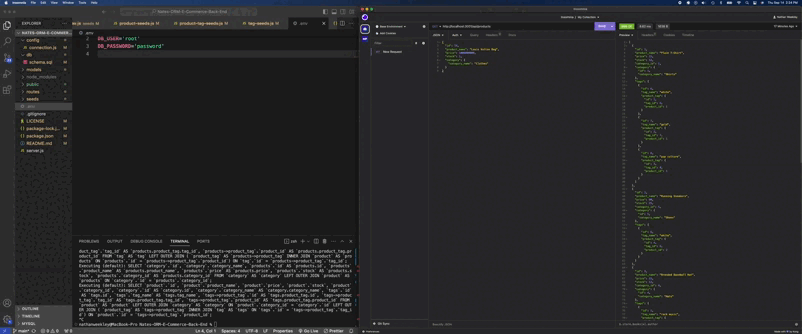
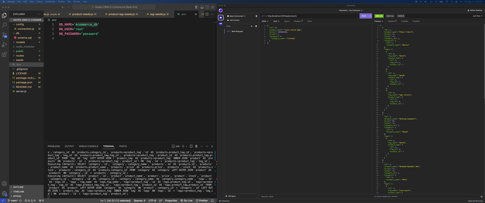

# Nates-ORM-E-Commerce-Back-End
[](https://opensource.org/licenses/MIT)


## Description
Back end for an e-commerce site by modifying starter code utilizing MySQL & Insomnia to test seeding & Post/Get/Delete functions.

## Table of Contents:
- [Overview](#Overview)
- [The Challenge](#The-Challenge)
- [Usage Instructions](#Usage-Instructions)
- [YouTube Walkthrough Video](#YouTube-Walkthrough-Video)
- [Installation Process](#Installation-Process)
- [Built With](#Built-With)
- [What I Learned](#What-I-Learned)
- [Future Development](#Future-Development)
- [License](#License)
- [Author](#Author)
- [Acknowledgments](#Acknowledgments)

# Overview

## The Challenge:
This challenge requires the creation of an e-commerce back-end site that meets specific user requirements. This includes the ability to connect to a MySQL database using Sequelize, create a development database that is seeded with test data, sync Sequelize models to the MySQL database, and display data from categories, products, and tags in a formatted JSON. The application should also be able to create, update, and delete data in the database.
## User Story

```md
AS A manager at an internet retail company
I WANT a back end for my e-commerce website that uses the latest technologies
SO THAT my company can compete with other e-commerce companies
```

## Acceptance Criteria

```md
GIVEN a functional Express.js API
WHEN I add my database name, MySQL username, and MySQL password to an environment variable file
THEN I am able to connect to a database using Sequelize
WHEN I enter schema and seed commands
THEN a development database is created and is seeded with test data
WHEN I enter the command to invoke the application
THEN my server is started and the Sequelize models are synced to the MySQL database
WHEN I open API GET routes in Insomnia for categories, products, or tags
THEN the data for each of these routes is displayed in a formatted JSON
WHEN I test API POST, PUT, and DELETE routes in Insomnia
THEN I am able to successfully create, update, and delete data in my database
```
## GIF:
###

The following animation demonstrates the application functionality:
 

## Usage Instructions
1. Open the repository and run.
```console 
npm i
```
2. Double check the `package.json` file for dependancies (in this case: dotenv, express, mysql2 & sequelize). If not previously installed, install them.
```console
npm i dotenv express mysql2 sequelize
```  
3. Next update the `.env` file to include the DB: ecommerce_db, also include your personal Mysql Username & password.
4. Run the following MySQL shell commands in order:
```console
mysql -u root -p
    (enter password)

source db/schema.sql

show databases;

use ecommerce_db;

\q
```
3. To seed the database and then run it, in the console enter: 
```console
npm run seed

npm run watch nodemon
```
4. Useing Insomnia, goto http://localhost:3001 to test GET, PUT & DELETE functions for products, tags and categories.

## Deployed Application Link:
[Deployed Application Link:](https://github.com/Nweekley84/Nates-ORM-E-Commerce-Back-End)

## GitHub Repository:
[GitHub Repository:](https://github.com/Nweekley84/Nates-ORM-E-Commerce-Back-End)

## YouTube Walkthrough Video:
[Click Here to Watch](https://www.youtube.com/watch?v=DXA8uCWjW64)

## Screenshots:
### Figure 1. Screenshot
 

## Installation Process
1. Clone the Repository from GitHub (or) Download Zip Folder from Repository from GitHub.
2. Open the cloned (or downloaded) repository in any source code editor.
3. Open the integrated terminal of the document and follow the [Usage Instructions](#Usage-Instructions).

## Built With
- JSON:[ JSON](https://www.npmjs.com/package/json)
- Dynamic JavaScript
- Dotenv: [8.6.0](https://www.npmjs.com/package/dotenv)
- Express: [4.17.1](https://www.npmjs.com/package/express)
- Node.js: [Version 16.18.1](https://nodejs.org/en/blog/release/v16.18.1/)
- Express.js:[Express.js](https://expressjs.com/en/starter/installing.html)
- Node MySql2: [2.3.3](https://www.npmjs.com/package/mysql2)
- Sequelize: [6.29.3](https://www.npmjs.com/package/sequelize)
- Insomnia: [by Kong](https://insomnia.rest/)
- Nodemon: [2.0.12](https://www.npmjs.com/package/nodemon/v/2.0.12)
- License Badge: [Shields.io](https://shields.io/)
- Visual Studio Code: [Website](https://code.visualstudio.com/)

## What I Learned:
1. How to modify starter code within Express.js to create a functional back end for a preexisting e-commerce website.
2. Connecting to a MySQL database using Sequelize and updating the environment variable files.
3. How to create a database with test data using schema and seed commands from the shell.

## Future Development:
1. Build a client side front end to display all the database information with proper styling ect..

## License & Copyright ©
  
[](https://opensource.org/licenses/MIT) [Open Source Initiative Link](https://opensource.org/licenses/MIT)

### Copyright © 2023 Nathan Weekley
```md
Permission is hereby granted, free of charge, to any person obtaining a copy
of this software and associated documentation files (the "Software"), to deal
in the Software without restriction, including without limitation the rights
to use, copy, modify, merge, publish, distribute, sublicense, and/or sell
copies of the Software, and to permit persons to whom the Software is
furnished to do so, subject to the following conditions:

The above copyright notice and this permission notice shall be included in all
copies or substantial portions of the Software.

THE SOFTWARE IS PROVIDED "AS IS", WITHOUT WARRANTY OF ANY KIND, EXPRESS OR
IMPLIED, INCLUDING BUT NOT LIMITED TO THE WARRANTIES OF MERCHANTABILITY,
FITNESS FOR A PARTICULAR PURPOSE AND NONINFRINGEMENT. IN NO EVENT SHALL THE
AUTHORS OR COPYRIGHT HOLDERS BE LIABLE FOR ANY CLAIM, DAMAGES OR OTHER
LIABILITY, WHETHER IN AN ACTION OF CONTRACT, TORT OR OTHERWISE, ARISING FROM,
OUT OF OR IN CONNECTION WITH THE SOFTWARE OR THE USE OR OTHER DEALINGS IN THE
SOFTWARE.
```

## Author

© 2023 [Nathan Weekley](https://github.com/Nweekley84). Confidential and Proprietary. All Rights Reserved.

---
<br>

<div align="center">

[](https://github.com/Nweekley84) 

</div>
